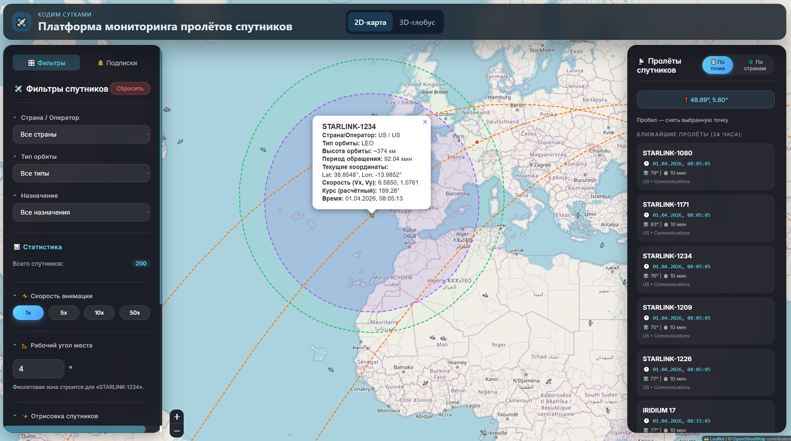
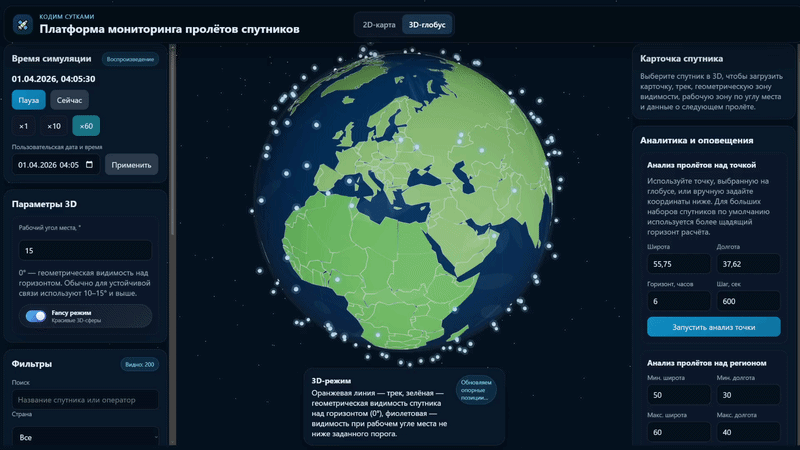
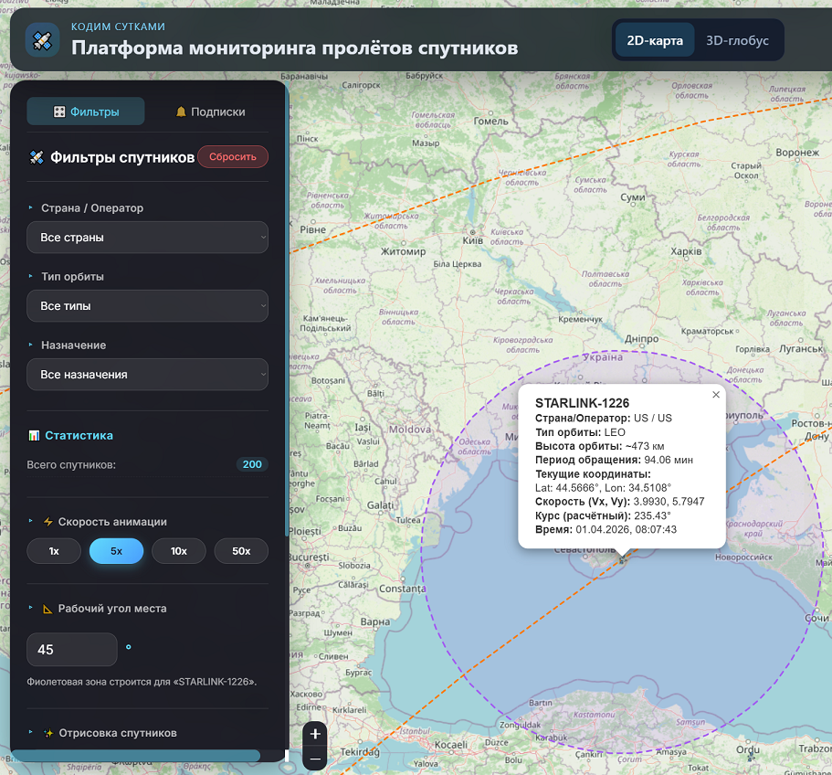
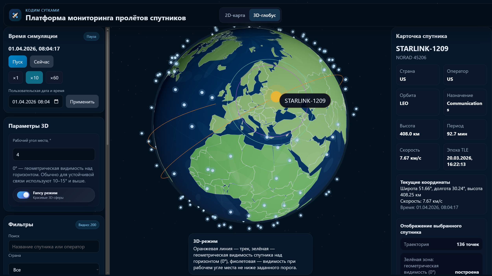
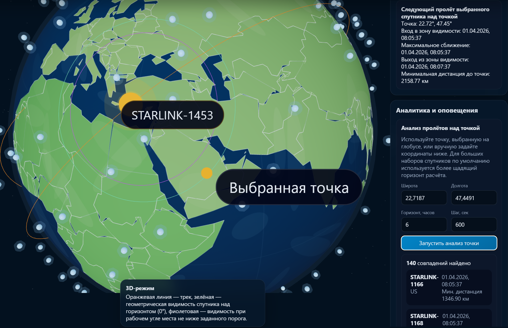
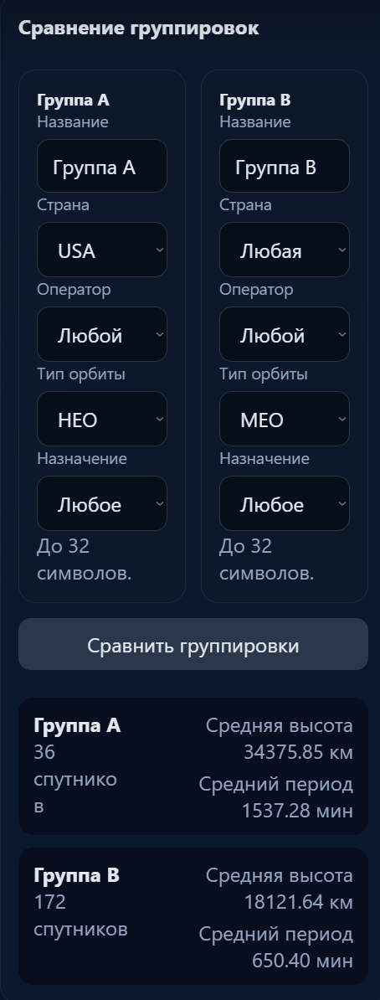

# Платформа мониторинга пролётов спутников

Это хакатонный проект про спутники и TLE-данные.

Берётся TLE, считается положение спутников, они показываются на карте, мы даём посмотреть, когда они пролетают над точкой или регионом.

<h2>Интерфейс</h2>

<p align="center">
  
</p>

<p align="center">
  <em>2D-режим: фильтры, список ближайших пролётов, карточка спутника и визуализация зоны видимости.</em>
</p>

<h3>3D-демо</h3>

<p align="center">
  
</p>

<p align="center">
  <em>3D-режим: движение спутников, симуляция времени и визуализация орбитальной сцены.</em>
</p>

<h3>Скриншоты</h3>

<p align="center">
  
  
</p>

<p align="center">
  
  
</p>

## Что умеет проект

### 2D
- посмотреть спутники на плоской карте мира
- посмотреть ближайшие пролёты мимо заданной точки
- посмотреть пролёты над заданной страной
- нажать на спутник и открыть его карточку с основной информацией
- увидеть угол наклона спутника
- фильтровать спутники по стране, оператору, типу орбиты и назначению
- посмотреть статистику по отфильтрованной выборке
- настраивать скорость анимации
- сравнить две группировки спутников
- создать подписки на пролёты и уведомления по выбранной точке

### 3D

- выбрать спутник
- посмотреть карточку спутника
- покрутить время
- увидеть траекторию
- поставить точку на Земле
- посчитать следующий пролёт
- посмотреть радиовидимость и покрытие
- искать пролёты над точкой
- искать пролёты над регионом
- сохранить подписки на уведомления (например о пересечении определённой точки)
- фильтровать спутники по стране, оператору, типу орбиты и назначению
- сравнить группы спутников

> По умолчанию в 2D и 3D на `Пробел` можно снять выделение спутника или точки.

## Стек

### Backend
- Python
- FastAPI
- SQLAlchemy
- PostgreSQL
- sgp4
- APScheduler

### Frontend
- React
- Leaflet для 2D
- Three.js / react-three-fiber для 3D
- Axios

## Запуск

### 1. Поднять PostgreSQL

```sql
CREATE DATABASE satmon;
```

### 2. Запустить backend

```bash
cd backend
cp .env.example .env
python -m venv .venv
source .venv/bin/activate
pip install -r requirements.txt
uvicorn app.main:app --reload
```

Backend поднимется на:

```text
http://127.0.0.1:8000
```

### 3. Загрузить демо-данные

```bash
curl -X POST http://127.0.0.1:8000/api/v1/tle/seed
```

### 4. Запустить frontend

```bash
cd frontend
npm install
npm start
```

Обычно фронт открывается на:

```text
http://localhost:3000
```

## Что можно делать

- выбрать спутник
- посмотреть его карточку
- покрутить время
- увидеть траекторию
- поставить точку на Земле (И посмотреть кто будет мимо неё пролетать)
- посчитать следующий пролёт над определённой траекторией
- посмотреть радиовидимость и покрытие
- сравнить группы спутников (по нашим параметрам)

## Основные API ручки

> По умолчанию автоматически сгенерированная документация FastAPI доступна на http://127.0.0.1:8000/docs

### Проверка
- `GET /health`
- `GET /api/v1/health`

### TLE
- `POST /api/v1/tle/upload`
- `POST /api/v1/tle/seed`
- `GET /api/v1/tle`
- `PUT /api/v1/tle/{satellite_id}`

### Спутники
- `GET /api/v1/satellites`
- `GET /api/v1/satellites/filters`
- `GET /api/v1/satellites/positions`
- `GET /api/v1/satellites/{satellite_id}`
- `GET /api/v1/satellites/{satellite_id}/track`
- `GET /api/v1/satellites/{satellite_id}/visibility`
- `GET /api/v1/satellites/{satellite_id}/coverage`
- `GET /api/v1/satellites/{satellite_id}/next-pass`

### Аналитика
- `POST /api/v1/analysis/passes-over-point`
- `POST /api/v1/analysis/passes-over-region`
- `POST /api/v1/analysis/compare-groups`

### Подписки
- `POST /api/v1/notifications/subscriptions`
- `GET /api/v1/notifications/subscriptions`